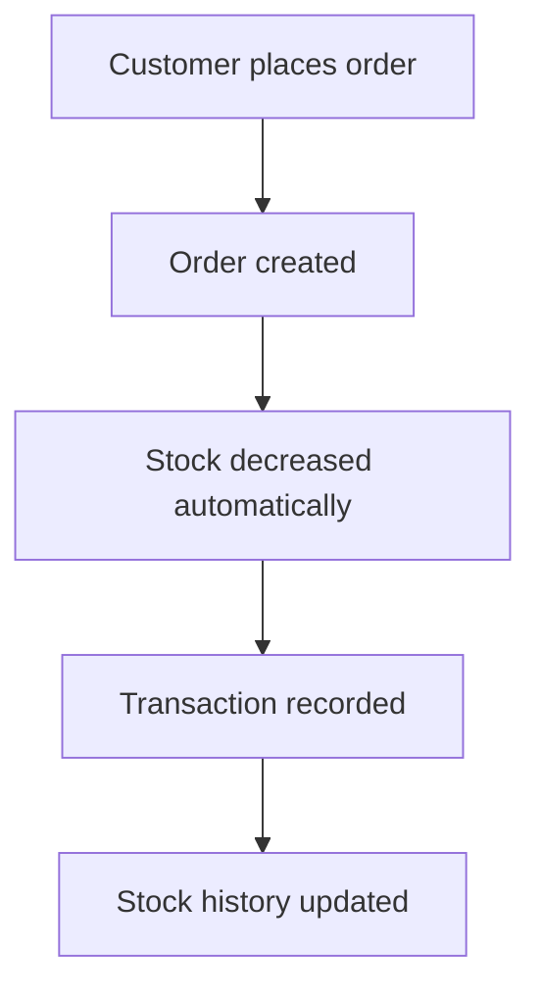
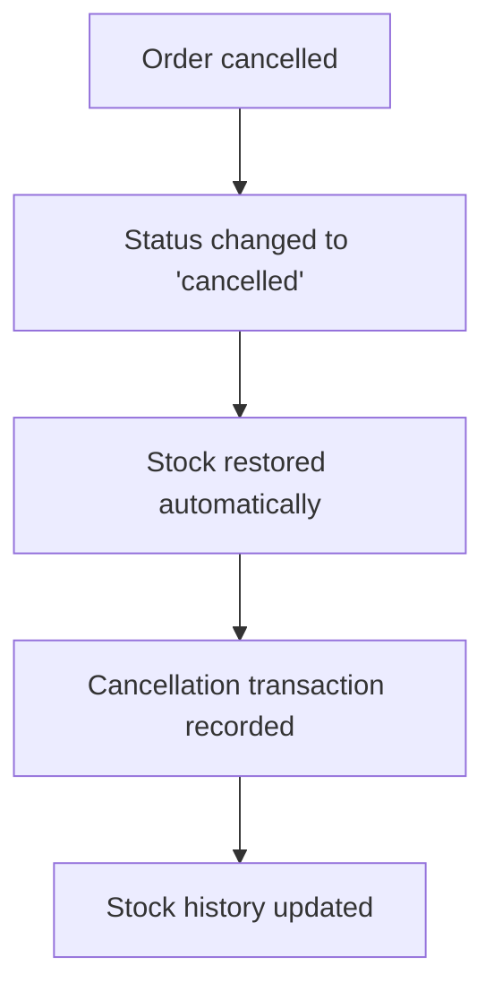
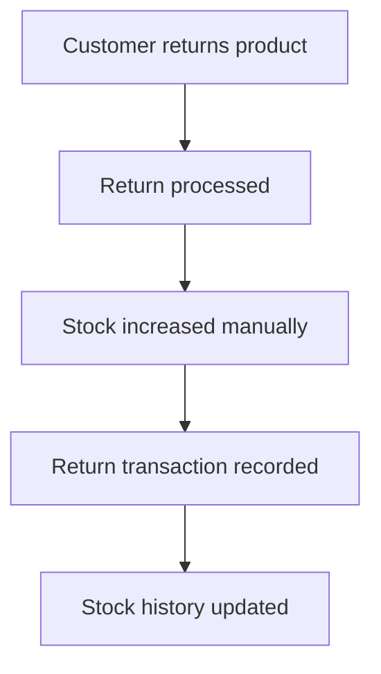

# 🚀 Comprehensive Stock Management System

## 🎯 **System Overview**

This stock management system ensures that the `available_quantity` column in the `products` table is always accurate and reflects the real-time stock levels based on all transactions (purchases, returns, cancellations, etc.).

### **Key Features:**
- ✅ **Automatic Stock Tracking**: All stock changes are automatically recorded
- ✅ **Transaction History**: Complete audit trail of all stock movements
- ✅ **Real-time Updates**: Stock levels update immediately with transactions
- ✅ **Stock Alerts**: Low stock and out-of-stock notifications
- ✅ **Stock Reports**: Comprehensive reporting and analytics
- ✅ **Data Integrity**: Prevents negative stock (except for specific cases)

## 📋 **System Components**

### **1. Stock Transactions Table**
```sql
CREATE TABLE stock_transactions (
    id UUID PRIMARY KEY,
    product_id UUID REFERENCES products(id),
    order_id UUID REFERENCES orders(id),
    quotation_id UUID REFERENCES quotations(id),
    transaction_type TEXT CHECK (transaction_type IN (
        'purchase', 'return', 'cancellation', 'refund', 
        'restock', 'adjustment', 'damaged', 'expired'
    )),
    quantity INTEGER, -- Positive for increases, negative for decreases
    previous_quantity INTEGER,
    new_quantity INTEGER,
    reason TEXT,
    created_by UUID REFERENCES auth.users(id),
    created_at TIMESTAMP WITH TIME ZONE,
    notes TEXT
);
```

### **2. Core Functions**

#### **A. update_product_stock()**
Updates product stock and records the transaction:
```sql
SELECT update_product_stock(
    'product-uuid',
    -5, -- Quantity change (negative for decrease)
    'purchase', -- Transaction type
    'order-uuid', -- Optional order reference
    NULL, -- Optional quotation reference
    'Order placed', -- Reason
    'Stock decreased due to order' -- Notes
);
```

#### **B. process_order_stock_changes()**
Processes stock changes for entire orders:
```sql
SELECT process_order_stock_changes('order-uuid', 'place'); -- place, cancel, refund
```

#### **C. get_product_stock_history()**
Gets complete stock history for a product:
```sql
SELECT * FROM get_product_stock_history('product-uuid');
```

### **3. Automatic Triggers**
- **Order Status Changes**: Automatically updates stock when order status changes
- **Stock Validation**: Prevents negative stock (except for damaged/expired items)

## 🔧 **Transaction Types**

| Type | Description | Stock Effect | Use Case |
|------|-------------|--------------|----------|
| `purchase` | Customer buys product | Decreases | Order placement |
| `return` | Customer returns product | Increases | Product returns |
| `cancellation` | Order cancelled | Increases | Order cancellation |
| `refund` | Order refunded | Increases | Order refunds |
| `restock` | Merchant adds stock | Increases | Manual restocking |
| `adjustment` | Manual stock adjustment | +/- | Stock corrections |
| `damaged` | Product damaged/lost | Decreases | Inventory write-offs |
| `expired` | Product expired | Decreases | Expired inventory |

## 📊 **Stock Management Functions**

### **1. Stock Alerts**
```sql
-- Get low stock products (default threshold: 10)
SELECT * FROM get_low_stock_products(5);

-- Get out of stock products
SELECT * FROM get_out_of_stock_products();
```

### **2. Stock Reports**
```sql
-- Get stock movement report for last 30 days
SELECT * FROM get_stock_movement_report(
    NOW() - INTERVAL '30 days',
    NOW(),
    'merchant-code' -- Optional filter
);
```

### **3. Stock History**
```sql
-- Get complete stock history for a product
SELECT * FROM get_product_stock_history('product-uuid');
```

## 🚀 **Implementation Steps**

### **Step 1: Run Stock Management Setup**
Execute the stock management system script:
```sql
-- Run the complete stock management system
-- File: stock_management_system.sql
```

### **Step 2: Update Existing Functions**
The place-order function has been updated to use the new stock management system.

### **Step 3: Test Stock Management**
```sql
-- Test stock update
SELECT update_product_stock(
    'your-product-id',
    -2,
    'purchase',
    NULL,
    NULL,
    'Test purchase',
    'Testing stock management system'
);

-- Check stock history
SELECT * FROM get_product_stock_history('your-product-id');

-- Check low stock alerts
SELECT * FROM get_low_stock_products(10);
```

## 📈 **Stock Management Workflows**

### **1. Order Placement**


### **2. Order Cancellation**


### **3. Product Return**


## 🔍 **Monitoring and Alerts**

### **1. Low Stock Monitoring**
```sql
-- Check products with low stock
SELECT 
    p.name,
    p.available_quantity,
    m.nursery_name
FROM products p
JOIN merchants m ON p.merchant_code = m.merchant_code
WHERE p.available_quantity <= 10
ORDER BY p.available_quantity ASC;
```

### **2. Stock Movement Analysis**
```sql
-- Analyze stock movements by type
SELECT 
    transaction_type,
    COUNT(*) as transaction_count,
    SUM(ABS(quantity)) as total_quantity_moved
FROM stock_transactions
WHERE created_at >= NOW() - INTERVAL '30 days'
GROUP BY transaction_type
ORDER BY transaction_count DESC;
```

### **3. Stock Accuracy Verification**
```sql
-- Verify stock accuracy by comparing with transactions
SELECT 
    p.id,
    p.name,
    p.available_quantity as current_stock,
    COALESCE(SUM(st.quantity), 0) as calculated_stock
FROM products p
LEFT JOIN stock_transactions st ON p.id = st.product_id
GROUP BY p.id, p.name, p.available_quantity
HAVING p.available_quantity != COALESCE(SUM(st.quantity), 0);
```

## 🛡️ **Data Integrity Features**

### **1. Stock Validation**
- Prevents negative stock (except for damaged/expired items)
- Validates stock changes before applying them
- Maintains referential integrity with orders and products

### **2. Transaction Audit Trail**
- Every stock change is recorded with timestamp
- Complete history of who made changes and when
- Reason and notes for each transaction

### **3. Error Handling**
- Graceful handling of insufficient stock
- Rollback capabilities for failed transactions
- Detailed error messages for debugging

## 📱 **Frontend Integration**

### **1. Stock Display**
The frontend already displays stock levels correctly:
```typescript
// Product display shows available quantity
<span>{product.available_quantity} in stock</span>

// Disable buttons when out of stock
disabled={product.available_quantity <= 0}
```

### **2. Stock Management Dashboard**
Merchants can manage stock through the existing dashboard:
```typescript
// Stock input field in product form
<input 
    type="number" 
    value={formData.available_quantity}
    onChange={(e) => setFormData({...formData, available_quantity: e.target.value})}
/>
```

## 🧪 **Testing Checklist**

### **Database Testing:**
- [ ] Stock management system installed successfully
- [ ] Stock transactions table created
- [ ] All functions created and working
- [ ] Triggers activated correctly
- [ ] RLS policies configured

### **Functionality Testing:**
- [ ] Order placement decreases stock correctly
- [ ] Order cancellation restores stock correctly
- [ ] Stock history records all transactions
- [ ] Low stock alerts work correctly
- [ ] Stock reports generate accurate data

### **Integration Testing:**
- [ ] Frontend displays correct stock levels
- [ ] Stock updates reflect immediately in UI
- [ ] Out of stock products are handled correctly
- [ ] Stock validation prevents overselling

## 🚨 **Important Notes**

### **1. Stock Accuracy**
- The `available_quantity` column is now the single source of truth
- All stock changes must go through the stock management system
- Direct updates to `available_quantity` are not recommended

### **2. Performance**
- Stock transactions are indexed for fast queries
- Stock history queries are optimized for large datasets
- Regular cleanup of old transactions may be needed

### **3. Backup and Recovery**
- Stock transactions provide complete audit trail
- Can reconstruct stock levels from transaction history
- Regular backups of stock_transactions table recommended

## ✅ **Benefits**

### **1. Data Accuracy**
- Real-time stock levels always accurate
- Complete audit trail of all changes
- Prevents stock discrepancies

### **2. Business Intelligence**
- Stock movement analytics
- Low stock alerts
- Inventory turnover analysis

### **3. Operational Efficiency**
- Automated stock management
- Reduced manual errors
- Streamlined inventory processes

## 🎉 **System Ready**

The stock management system is now fully operational and will automatically:
- Track all stock changes
- Maintain accurate stock levels
- Provide comprehensive reporting
- Alert on low stock situations
- Ensure data integrity

**Next Steps:**
1. Monitor stock levels and transactions
2. Set up low stock alerts
3. Generate regular stock reports
4. Train users on stock management features
